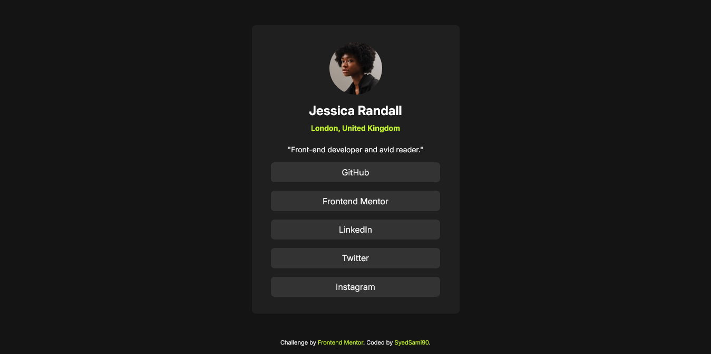

# Frontend Mentor - Social links profile solution

This is a solution to the [Social links profile challenge on Frontend Mentor](https://www.frontendmentor.io/challenges/social-links-profile-UG32l9m6dQ). Frontend Mentor challenges help you improve your coding skills by building realistic projects. 

## Table of contents

- [Overview](#overview)
  - [The challenge](#the-challenge)
  - [Screenshot](#screenshot)
  - [Links](#links)
- [My process](#my-process)
  - [Built with](#built-with)
  - [What I learned](#what-i-learned)
  - [Continued development](#continued-development)

- [Author](#author)

## Overview

### Screenshot

<!--  -->

### Links

- Solution URL: [Repository Home](https://github.com/Social-profile-template)
- Live Site URL: [Live Site](https://SyedSami90.github.io/Social-profile-template)

## My process

### Built with

- Semantic HTML5 markup
- CSS custom properties
- Flexbox

### What I learned

- Explored how to style and customize borders to enhance visual design.
- Learned to apply styles based on the state of links
- Discovered versatile and popular font families to elevate typography and enhance user experience.

### Continued development

I aim to enhance this website’s responsiveness, ensuring it works well across all devices, as I continue learning and improving my skills.

## Author

- Github- [SyedSami](https://github.com/SyedSami90)
- frontendmentor- [@SyedSami](https://github.com/SyedSami90)

